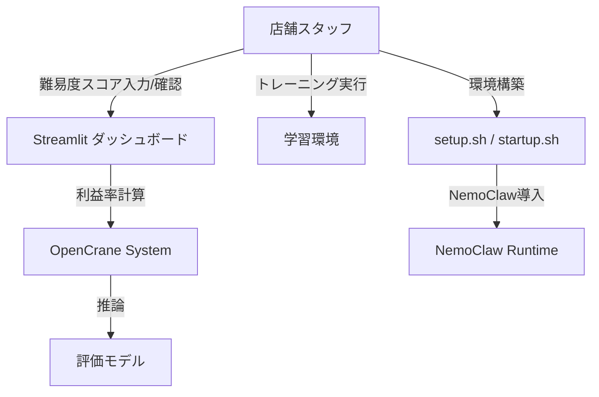
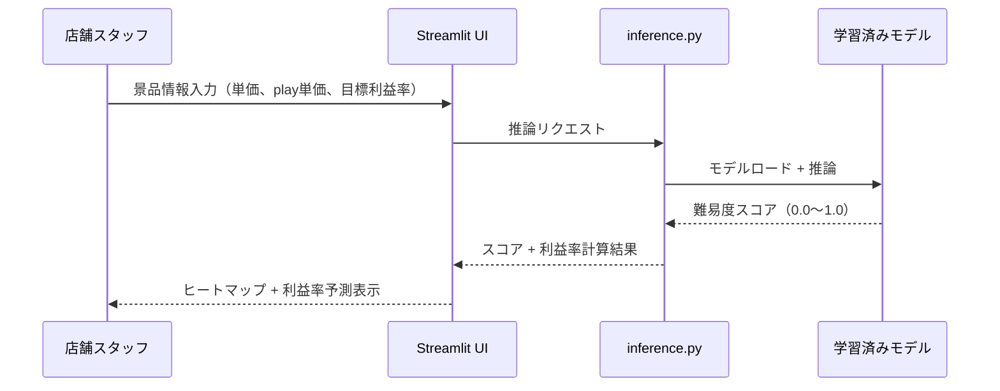

# 1. システム概要と制約事項

## 1.1 システムの目的

本システムは、
**クレーンゲーム運営者（店舗スタッフ・マネージャー）** が **景品配置の最適化** を行う際に発生する
**人による補充品質のばらつきが利益率に直結する** という課題を背景として、
**AIによる難易度評価と利益率予測ダッシュボード** を実装し、
**景品配置の定量的な評価と利益率の安定化** を実現することを目的とする。

**コンテキスト:** GTC 2026 Hack for Impact（Culture Impact トラック）向けハッカソンデモ。制限時間4時間。

## ユースケース図



## 1.2 システム範囲

#### 機能スコープ

###### 機能要件（4時間で実装）
1. **利益率計算ダッシュボード** — 難易度スコアと景品単価から利益率を予測・表示するStreamlit UI
2. **推論パイプライン** — 学習済みモデル（or モック）で難易度スコアを算出する `inference.py`
3. **トレーニング環境** — `train.py` + `setup_train.sh` で学習が動く環境（デモレベル）
4. **NemoClaw導入スクリプト** — `startup.sh` でNemoClaw環境をセットアップ

###### 検討中の機能（デモ後）
- カメラからのリアルタイム景品検出（既存システムとの統合）
- 重心推定モデルの本格的な学習
- Jetson Orin Nano 8GBへのモデル蒸留・デプロイ

###### スコープ外
- ユーザー認証・アカウント管理
- データベース永続化（デモはインメモリ/CSV）
- 本番環境デプロイ
- 多店舗対応

#### 終了条件
本システムは、"機能要件" 4項目がすべて動作する状態で、ハッカソンデモとして成立したものとみなす。

## ユーザー規模・利用条件
- 想定ユーザー数：デモ審査員 + 会場参加者（〜10人）
- 利用環境：GB10（DGX Spark）+ ローカルPC
- デモ時：ngrok経由でlocalhostを公開

## 1.3 参加者と役割

| 参加者 | 役割 | 権限/責任 |
|--------|------|----------|
| 店舗スタッフ | ダッシュボード操作、景品情報入力 | 閲覧・入力 |
| システム（OpenCrane） | 難易度評価・利益率計算 | 推論実行 |
| NemoClaw | サンドボックス実行環境 | エージェント実行基盤 |
| GB10 | 学習・推論ハードウェア | GPU計算 |

---

# 2. 詳細なワークフロー

## 2.1 プロセス1: 利益率計算ダッシュボード

| ステップ | 内部的処理 |
|---------|-----------|
| 店舗スタッフ | Streamlit UIを開く |
| システム | 景品情報入力フォームを表示（景品名、単価、play単価、目標利益率） |
| 店舗スタッフ | 景品情報を入力 or 画像をアップロード |
| システム（inference.py） | 難易度スコアを算出（0.0〜1.0） |
| システム | `全体当たりやすさ × 景品単価 = play単価 × 回数 × 予定利益率` で利益率を計算 |
| システム | ヒートマップ + 利益率予測をダッシュボードに表示 |
| 店舗スタッフ | 配置の良し悪しを判断 |

## 2.2 プロセス2: トレーニング環境

| ステップ | 内部的処理 |
|---------|-----------|
| 開発者 | `setup_train.sh` を実行 |
| システム | 学習用ライブラリをインストール |
| 開発者 | `train.py` を実行（.envからパラメータ読み込み） |
| システム | モデルを学習し `/training/models/` に保存 |

## 2.3 プロセス3: NemoClaw環境構築

| ステップ | 内部的処理 |
|---------|-----------|
| 開発者 | `startup.sh` を実行 |
| システム | NemoClawをインストール・onboard実行 |
| システム | サンドボックス環境を構築 |
| 開発者 | NemoClaw環境内でOpenClawを利用可能に |

## Workflow Diagram

```mermaid
flowchart TD
    Start[開始] --> Setup{環境構築}
    Setup -->|startup.sh| NemoClaw[NemoClaw導入]
    Setup -->|setup_train.sh| TrainEnv[学習環境構築]

    TrainEnv --> Train[train.py でモデル学習]
    Train --> SaveModel[/training/models/ に保存]

    SaveModel --> Inference[inference.py で推論]
    NemoClaw --> Inference

    Inference --> Dashboard[Streamlit ダッシュボード]
    Dashboard --> Input[景品情報入力]
    Input --> Calc[利益率計算]
    Calc --> Display[ヒートマップ + 利益率表示]
    Display --> Judge[配置判断]
```

## シーケンス図



---

# 3. 異常系

## 3.1 ダッシュボード異常系

| 危険な行動・状況 | 発生要因 | 防御レイヤー1（仕様） | 防御レイヤー2（実装） | 結果 |
|---------------|---------|-------------------|-------------------|------|
| 不正な単価入力（負の値） | 入力ミス | 入力バリデーション | Streamlit number_input の min_value=0 | エラー表示 |
| モデルファイルが存在しない | 未学習 | デフォルトモックモデル提供 | try/except でフォールバック | モックスコアで動作継続 |

## 3.2 学習環境異常系

| 危険な行動・状況 | 発生要因 | 防御レイヤー1（仕様） | 防御レイヤー2（実装） | 結果 |
|---------------|---------|-------------------|-------------------|------|
| GPU不足 | デバイス制約 | .envでデバイス指定 | CPU フォールバック | 警告表示して続行 |
| データ不足 | データ未準備 | サンプルデータ同梱 | エラーメッセージ | 明確なエラー |

---

# 4. API仕様

```api
# 内部API（Streamlit内部で呼び出し）

POST /predict
  Input: { image_path: str, prize_cost: float, play_cost: float, target_margin: float }
  Output: { difficulty_score: float, hit_probability: float, expected_profit: float, heatmap: array }

POST /train
  Input: { data_dir: str, epochs: int, batch_size: int }
  Output: { model_path: str, loss: float, accuracy: float }
```

---

# 共通言語

| 用語 | 定義 |
|------|------|
| 難易度スコア | 景品の取りやすさを0.0（取れない）〜1.0（簡単に取れる）で表す指標 |
| 重心 | 景品の重さの中心点。アームが掴む際の成功率に直結 |
| 利益率 | `(売上 - 景品原価) / 売上` で算出される収益性指標 |
| play単価 | 1回のクレーンゲームプレイにかかる料金（例: 100円） |
| ヒートマップ | 景品配置における取りやすさの空間的分布を色で可視化したもの |
| NemoClaw | NVIDIAのOpenClawエージェントをサンドボックスで安全に実行するツールキット |
| GB10 | NVIDIA DGX Spark のBlackwellアーキテクチャデバイス |
